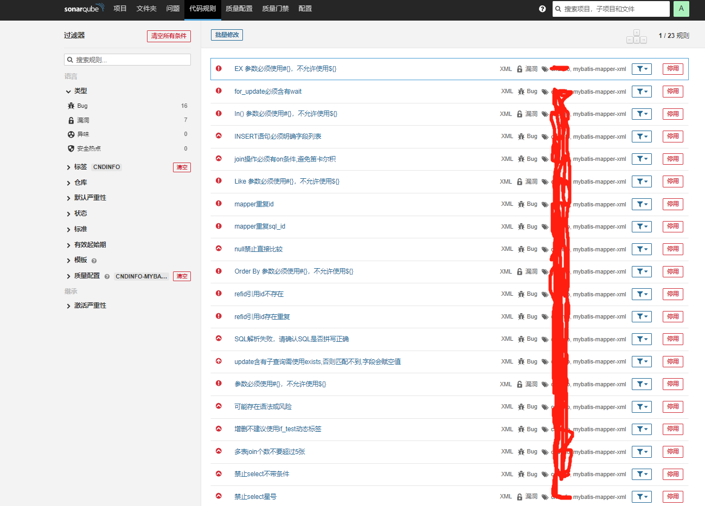
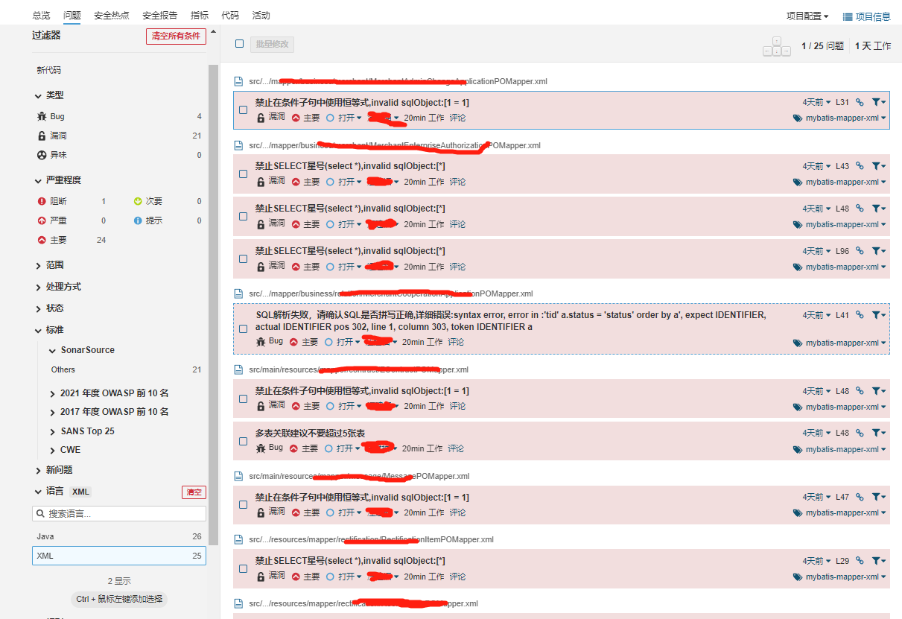

## SonarQube MyBatis Mapper XML Plugin
MyBatis Mapper XML Plugin for SonarQube: Rules to check SQL statements in MyBatis Mapper XML files.

## What is Risk SQL?
Risk SQL is that in the mybatis mapper file, there are some dynamic SQL.

two example as follows:

```
# example 1
# if all <if> conditon is null,will delete all data

DELETE FROM table_name
WHERE 8=8
<if test="startTime != null">
    AND start_time <![CDATA[=]]> #{startTime}
</if>
<if test="endTime != null">
    AND end_time <![CDATA[=]]> #{endTime}
</if>

# example 2
# 1.sql injection risk: should use #{queryParam} in replace
# 2.should not use [*] to query all column

SELECT * FROM user where user.name = ${queryParam}

```

## MyBatis Rules
There are 23 built-in mybatis rules




## How to install it?
There are two options to install a plugin into SonarQube:
- Manual Installation - place the plugin jar to sonarqube plugin dir

## How to Use it?
There is an example of using maven build command:
```
mvn clean compile -U -Dmaven.test.skip=true -Dmaven.javadoc.skip=true sonar:sonar -Dsonar.host.url=http://127.0.0.1:9000/ -Dsonar.projectKey=demo -Dsonar.projectName=demo -Dsonar.sourceEncoding=UTF-8 -Dsonar.sources=. -Dsonar.inclusions=src/main/** -Dsonar.exclusions==src/main/webapp/**
```
To analysis mybatis mapper file, `src/main/resources` dir must be in `sonar.sources`.

## Skip MyBatis Sensor
If you want to skip mybatis sensor sometimes, you can change the global properties `sonar.mybatis.skip` to `true` or add the parameter in the command:
`-Dsonar.mybatis.skip=true` .

## Check Result



## How to Add New Rule

### SQL Expr Check

- add new rule class extend AbstractRule under folder [src/main/java/org/sonarsource/plugins/mybatis/sql/rules]
- specify the rule in the rule Class
- add the rule full name in file [src/main/resources/META-INF/services/org.sonarsource.plugins.mybatis.sql.AbstractRule] to regist the rule

### Regular Check

- define the rule in file [org/sonarsource/plugins/mybatis/regular/enums/RuleCodeEnum.java]
- do the rule check in file [org/sonarsource/plugins/mybatis/regular/parser/RegularRuleHandler.java#doRuleAll()]

## Feature
- add more sql check rule
- support ibatis xml check

## Support Author

