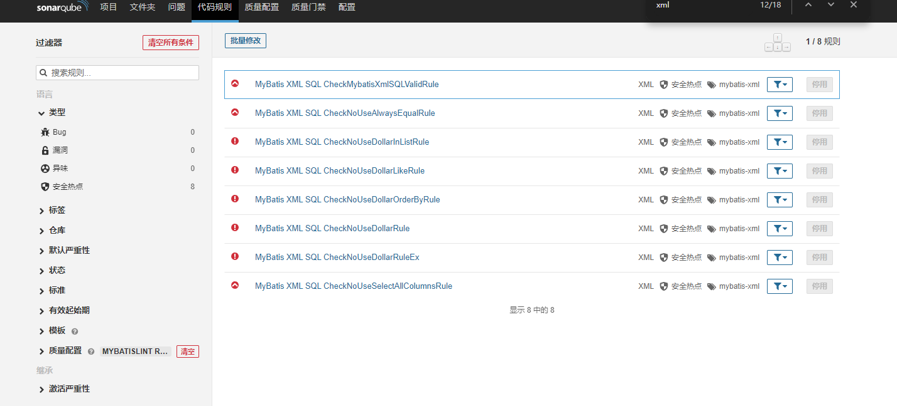
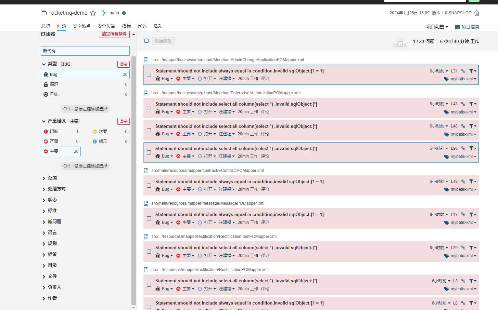

## SonarQube MyBatis Plugin
MyBatis Plugin for SonarQube: Rules to check SQL statements in MyBatis Mapper XML files.

## What is Risk SQL?
Risk SQL is that in the mybatis mapper file, there are some dynamic SQL, such as `<if test=""></if>` elements of Mapper file, 
if all parameters in the SQL statement elements of Mapper XML file are null , the SQL may at great risk.

an example as follows:

```
DELETE FROM table_name
WHERE 1=1
<if test="startTime != null">
    AND start_time <![CDATA[=]]> #{startTime}
</if>
<if test="endTime != null">
    AND end_time <![CDATA[=]]> #{endTime}
</if>
```

## MyBatis Rules
There are 7 built-in mybatis rules, which select statement has three rules, update and delete statement has two rules.



## How to install it?
There are two options to install a plugin into SonarQube:
- Marketplace - Installs plugins automatically, from the SonarQube UI.
- Manual Installation - You'll use this method if your SonarQube instance doesn't have access to the Internet.

## How to Use it?
There is an example of using maven build command:
```
mvn clean compile -U -Dmaven.test.skip=true -Dmaven.javadoc.skip=true sonar:sonar -Dsonar.host.url=http://127.0.0.1:9000/ -Dsonar.projectKey=demo -Dsonar.projectName=demo -Dsonar.sourceEncoding=UTF-8 -Dsonar.sources=. -Dsonar.inclusions=src/main/** -Dsonar.exclusions==src/main/webapp/**
```
To analysis mybatis mapper file, `src/main/resources` dir must be in `sonar.sources`.

## Skip MyBatis Sensor
If you want to skip mybatis sensor sometimes, you can change the global properties `sonar.mybatis.skip` to `true` or add the parameter in the command:
`-Dsonar.mybatis.skip=true` .

## Check result



## How to Add New Rule

### SQL Expr Check

- add new rule class extend AbstractRule under folder [src/main/java/org/sonarsource/plugins/mybatis/sql/rules]
- specify the rule in the rule Class
- add the rule full name in file [src/main/resources/META-INF/services/org.sonarsource.plugins.mybatis.sql.AbstractRule] to regist the rule

### Regular Check

- define the rule in file [org/sonarsource/plugins/mybatis/wang/enums/RuleCodeEnum.java]
- do the rule check in file [org/sonarsource/plugins/mybatis/wang/parser/RegularRuleHandler.java#doRuleAll()]